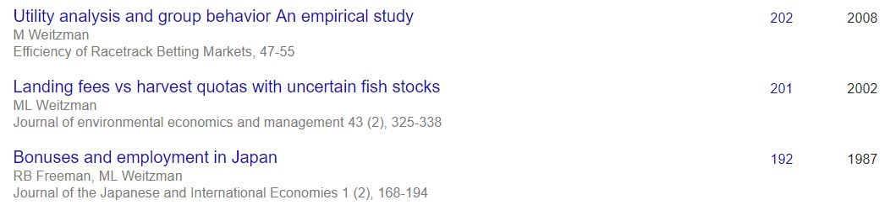
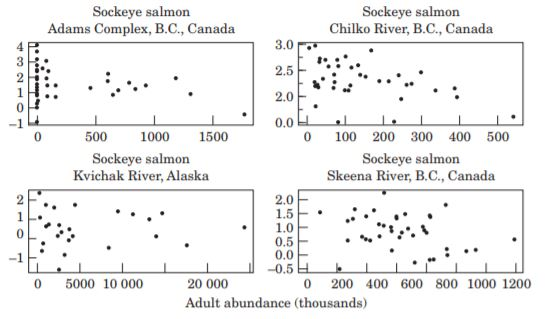

```{r, echo = F}
suppressPackageStartupMessages({
  library(cowplot)
  library(tidyverse)
})
```


# By the same author:

- Weitzman. 1974. Prices vs quantities. RES. (3,683 GSC)
- Weitzman. 2001. Gamma Discounting. AER (1,027 GSC)
- Weitzman. 2009. On Modeling and Interpreting the Economics of Catastrophic Climate Change. RES. (1,409 GSC)

# This paper




# The problem

- Fisheries seem to be preferably managed with ITQs that rely on TAC.
- Managers do not observe recruitment when deciding on management measures.
- Uncertainty comes from stock-recruitment relationship.
- There is a lot of environmental variability.
- We are bad at measuring S and R.
- How bad is it?

# It's bad



# Models for SR

## Ricker (1954)

$$R = aSe^{-bS}$$

## Beverton-Holt (1957)

$$R = \frac{aS}{1+bS}$$

# Relationship varies through time


# The literature

Optimal constant escapement and stochasticity (Reed, 1979):

- $H^* = \max(X - S*, 0)$
- X is known prior to the harvest decission
- Works well for things like salmon

Optimal harvest and value of SS (Clark & Kirkwood, 1986):

- X is unknown (but incorporate information about previous)
- Bayesian
- Only numerical solution
- Build on value of SA


# The paper

## Setting

- Stock-recruitment uncertainty as a form of *environmental uncertainty*
- Setting $Q$ has the benefit of fixing the number of fish being caught
- A fixed $Q$ set without knowledge of $X$ may put too much pressure on the stock
- Landing fees are better at controlling the *marginal* effort

# The paper

## Main finding

- Under stock-recruitment uncertainty, a harvest fee achieves the same outcome as if the manager was *myopically omniscient*.
- It's about the *optimal escapement* not *optimal harvest* (optimal escapement is very difficult to control)

## What's different?

- Like Clark & Kirkwood, (1986) X is unknown
- Contrast landings fee and ITQ
- Analytical solution for both

# The model

## The bio

- $R_t = F(S_{t-1} | \varepsilon_t)$

- $S_t = R_t - H_t$

- Where $\varepsilon$ is $\mathrm{iid}$

## The econ

- Marginal profits are $\pi(x) = p - c(x)$

- Total profits are: $\int_{S_t}^{R_t}\pi(x)\; dx$

- Where $\pi'(x) > 0$

# The goal

The manager must maximize the expected (discounted) profits by inducing fishers to choose optimal $H_t$:

$$
\mathbb{E}\left[\sum_{t = 1}^\infty{}\alpha^{t-1}\int_{S_t}^{R_t}\pi(x)\; dx\right]
$$

# The timing

> The paper works with a model whose informational timing forces the regulatory instruments to be set when the size of the relevant resource stock is unknown

- Regulators observe (estimate) escapement ($S_{t-1}$) at the end of $t-1$
- Between $t-1$ and $t$, managers assign best value (landings fee $\Phi$ or TAC $Q$)
- Fishers *observe* the realization of $\varepsilon_t$ as $R_t = F(S_{t-1} | \varepsilon_t)$
- Fishers harvest $H_t$ and leave $S_t$, so the manager now knows $S_t$ for the next time period

# Almost done

Fishers have a *response function* for each case

## Quota

$$H_q = (Q; S | \varepsilon)$$

## Landing fee

$$H_\varphi = (\Phi; S | \varepsilon)$$

# The value functions

$$
\begin{split}
V_q(S) &= \max_{Q \geq 0}{\mathbb{E}_{\varepsilon}\left[\int_{F(S|\varepsilon)-H(Q; S | \varepsilon)}^{F(S|\varepsilon)}\pi(x)\; dx + \alpha V_q(F(S|\varepsilon) - H_q(Q; S | \varepsilon))\right]} \\
&\textrm{with solution} \\
&\hat{Q}(S)
\end{split}
$$

$$
\begin{split}
V_\varphi(S) &= \max_{\Phi \geq 0}{\mathbb{E}_{\varepsilon}\left[\int_{F(S|\varepsilon)-H(\Phi; S | \varepsilon)}^{F(S|\varepsilon)}\pi(x)\; dx + \alpha V_q(F(S|\varepsilon) - H_\varphi(\Phi; S | \varepsilon))\right]} \\
&\textrm{with solution} \\
&\hat{\Phi}(S)
\end{split}
$$

# Last bit

$$
\begin{split}
V^*(S; \varepsilon) &= \max_{Q \geq 0}{\left[\int_{F(S|\varepsilon)-H(Q; S | \varepsilon)}^{F(S|\varepsilon)}\pi(x)\; dx + \alpha \tilde{\mathbb{E}}\left[V^*((F(S|\varepsilon) - Q); \tilde{\varepsilon})\right]\right]} \\
&\textrm{with solution} \\
&Q^*(S; \varepsilon)
\end{split}
$$

# Results

Managers set: $\hat{\Phi}(S)$

$$
\underbrace{H_\varphi(\hat{\Phi}(S); S | \varepsilon)}_\text{Harvest response with fee} = \underbrace{Q^*(S; \varepsilon)}_\text{Myopically omniscient TAC}
$$

Intuition:

A landings fee will always result in the optimum escapement policy

# Optimal escapement

```{r, echo = F, fig.width = 6, fig.height = 5}
alpha <- 1.4
beta <- 5000
sigma <- 0.6
h <- 20

set.seed(43)
rnd <- rnorm(100, 0, 1)

x0 <- 5000

# Low Q
x <- vector()
x_rnd <- vector()
catches <- vector()
S <- vector()
R <- vector()
x[1] <- x0
q <- 500

for(i in 1:100){
  R[i] <- x[i] * exp(alpha * (1-(x[i]/beta)))
  x_rnd[i] <- R[i] * exp(sigma * rnd[i] - sigma^2/2)
  catches[i] <- min(q, x_rnd[i])
  x[i+1] <- x_rnd[i] - catches[i]
}

lq <- tibble(time = 1:100,
       x = x[1:100],
       catches = catches) %>% 
  gather(variable, value, -time) %>% 
  ggplot(aes(x = time, y = value, fill = variable)) +
  geom_col() +
  scale_fill_brewer(palette = "Set1") +
  theme(legend.position = "None")

# High Q
x <- vector()
x_rnd <- vector()
catches <- vector()
S <- vector()
R <- vector()
x[1] <- x0
q <- 800

for(i in 1:100){
  R[i] <- x[i] * exp(alpha * (1-(x[i]/beta)))
  x_rnd[i] <- R[i] * exp(sigma * rnd[i] - sigma^2/2)
  catches[i] <- min(q, x_rnd[i])
  x[i+1] <- x_rnd[i] - catches[i]
}

hq <- tibble(time = 1:100,
       x = x[1:100],
       catches = catches) %>% 
  gather(variable, value, -time) %>% 
  ggplot(aes(x = time, y = value, fill = variable)) +
  geom_col() +
  scale_fill_brewer(palette = "Set1") +
  theme(legend.position = "None")


# Constant S

x <- vector()
x_rnd <- vector()
catches <- vector()
S <- vector()
R <- vector()
x[1] <- x0
escapement <- 3000

for(i in 1:100){
  R[i] <- x[i] * exp(alpha * (1-(x[i]/beta)))
  x_rnd[i] <- R[i] * exp(sigma * rnd[i] - sigma^2/2)
  S <- min(x_rnd[i], escapement)
  catches[i] <- x_rnd[i] - S
  x[i+1] <- x_rnd[i] - catches[i]
}

s <- tibble(time = 1:100,
       x = x[1:100],
       catches = catches) %>% 
  gather(variable, value, -time) %>% 
  ggplot(aes(x = time, y = value, fill = variable)) +
  geom_col() +
  scale_fill_brewer(palette = "Set1") +
  theme(legend.position = "None")

cowplot::plot_grid(lq, hq, s, ncol = 1)

```


# Thoughts

- On both stochastic cases, the result relies on the fishers observing the realization of $\varepsilon$ from $R_t = F(S_{t-1} | \varepsilon_t)$
- Fishers need to know the shape of their marginal costs
- A flat marginal profit function of fish stocks favors quotas
- Weitzman calls for the characterization of fisheries that are better regulated by one method or the other (See Jensen & Vestergaard, (2003))

# Applications


# Extensions

```{r, echo = F, fig.height = 4, fig.width = 6}
tibble(x = 1:100) %>% 
  mutate(Hyperdepletion = x ^ 5 / 1e8,
         Hyperstability = 100 - (100/x),
         Linear = x) %>% 
  gather(variable, value, -x) %>% 
  ggplot(aes(x, value, group = variable, color = variable)) +
  geom_line(size = 1.1) +
  scale_color_brewer(palette = "Set1") +
  theme_bw() +
  ylab("Catchability") +
  xlab("Stock size (S)") +
  scale_x_continuous(breaks = NULL) +
  scale_y_continuous(breaks = NULL) +
  guides(color = guide_legend(title = "Relationship"))
```

# Further reading

W.J. Reed. 1979. Optimal Escapement Levels in Stochastic and Deterministic Harvesting Models. *JEEM* 6, 350-363

C.W. Clark and G.P. Kirkwood. 1986. Optimal Harvest Policies and the Value of Stock Surveys. *JEEM* 13, 235-244

D.G. Moloney and  P.H Pearse. 1979. Quantitative Rights as an Instrument for Regulating Commerncial Fisheries. *Journal of  Fisheries Research Board Canada*. 36: 859-86

F. Jensen and N. Vestergaard. 2003. Prices versus Quantities in Fisheries Model. *Land Economics*, Vol. 79, No. 3 (Aug., 2003), pp. 415-425

C. Costello, S.D. Gaines, J. Lynham. 2008. Can catch shares prevent fisheries collapse? *Science*, 321 (5896), 1678-1681


